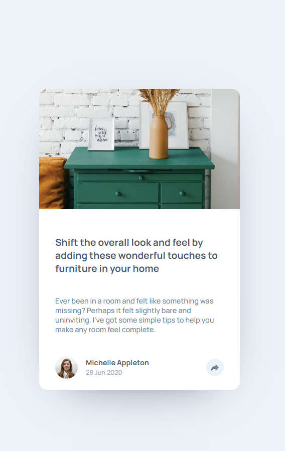
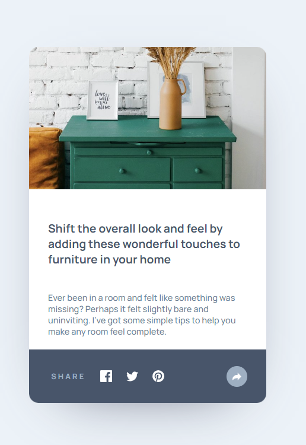

# Frontend Mentor - Article preview component solution

This is a solution to the [Article preview component challenge on Frontend Mentor](https://www.frontendmentor.io/challenges/article-preview-component-dYBN_pYFT). Frontend Mentor challenges help you improve your coding skills by building realistic projects.

## Table of contents

- [Overview](#overview)
  - [The challenge](#the-challenge)
  - [Screenshot](#screenshot)
  - [Links](#links)
- [My process](#my-process)
  - [Built with](#built-with)
  - [What I learned](#what-i-learned)
- [Author](#author)

## Overview

### The challenge

Users should be able to:

- View the optimal layout for the component depending on their device's screen size
- See the social media share links when they click the share icon

### Screenshot

### Links

- Solution URL: [Solution in Frontmentor](https://www.frontendmentor.io/solutions/repsonsibe-web-design-mobile-first-css-grid-css-flexbox-DAFN-PMHYq)
- Live Site URL: [Live solution](https://tucznik2.github.io/article-preview-component/)

## My process

### Built with

- Semantic HTML5 markup
- CSS custom properties
- Flexbox
- CSS Grid
- Mobile-first workflow
- Vanilla JS

### What I learned

I've practised css flex, managing events and styling via js.

## Author

- GitHub - [Add your name here](https://github.com/Tucznik2)
- Frontend Mentor - [@yourusername](https://www.frontendmentor.io/profile/Tucznik2)
